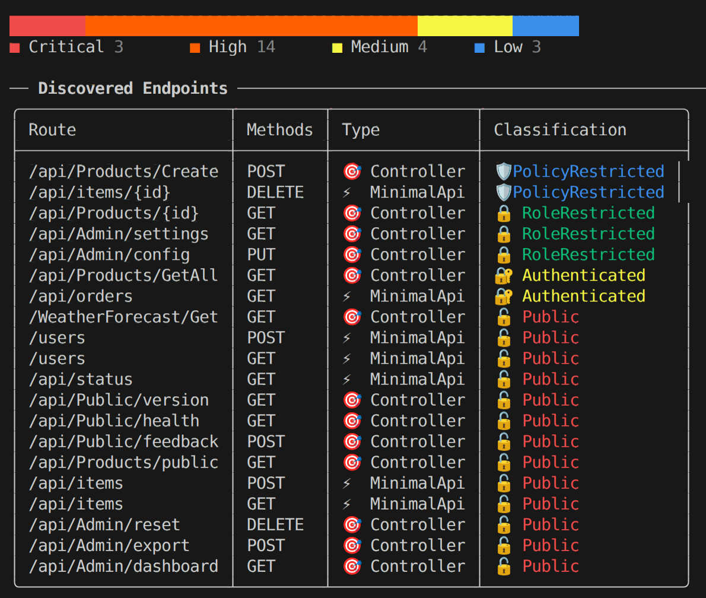
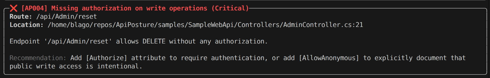

# ApiPosture

[](https://github.com/BlagoCuljak/ApiPosture/actions/workflows/build.yml)
[](https://www.nuget.org/packages/ApiPosture)
[](https://www.nuget.org/packages/ApiPosture)
[](https://opensource.org/licenses/MIT)
[](https://dotnet.microsoft.com/)
[](https://checkout.revolut.com/pay/525834c6-21cd-4d72-bb99-2dc27d3a0a6d)

A cross-platform CLI security inspection tool for ASP.NET Core APIs. Performs static source-code analysis using Roslyn to identify authorization misconfigurations and security risks.

### Terminal Output



### Findings Report



## Features

- Static analysis of ASP.NET Core projects (no compilation required)
- Discovers endpoints from both Controllers and Minimal APIs
- Detects 8 common security issues with authorization
- Multiple output formats: Terminal, JSON, Markdown
- Sorting, filtering, and grouping of results
- Configuration file support with suppressions
- Accessibility options (no-color, no-icons)
- CI/CD integration with `--fail-on` exit codes
- Cross-platform .NET Global Tool

## Installation

```bash
# Install as global tool
dotnet tool install --global ApiPosture

# Or from local build
dotnet pack src/ApiPosture -c Release
dotnet tool install --global --add-source ./src/ApiPosture/nupkg ApiPosture
```

## Usage

```bash
# Scan current directory
apiposture scan .

# Scan specific project
apiposture scan ./src/MyWebApi

# Output as JSON
apiposture scan . --output json

# Output as Markdown report
apiposture scan . --output markdown --output-file report.md

# Filter by severity
apiposture scan . --severity medium

# CI integration - fail if high severity findings
apiposture scan . --fail-on high

# Sorting
apiposture scan . --sort-by route --sort-dir asc

# Filtering
apiposture scan . --classification public --method POST,DELETE
apiposture scan . --route-contains admin --api-style controller

# Grouping
apiposture scan . --group-by controller
apiposture scan . --group-findings-by severity

# Accessibility (no colors/icons)
apiposture scan . --no-color --no-icons

# Use config file
apiposture scan . --config .apiposture.json
```

## Configuration File

Create `.apiposture.json` in your project root:

```json
{
  "severity": { "default": "low", "failOn": "high" },
  "suppressions": [
    { "route": "/api/health", "rules": ["AP001"], "reason": "Intentionally public" }
  ],
  "rules": {
    "AP007": { "sensitiveKeywords": ["admin", "debug", "secret"] }
  },
  "display": { "useColors": true, "useIcons": true }
}
```

## Security Rules

| Rule ID | Name | Severity | Description |
|---------|------|----------|-------------|
| AP001 | Public without explicit intent | High | Endpoint is publicly accessible without `[AllowAnonymous]` |
| AP002 | AllowAnonymous on write | High | `[AllowAnonymous]` on POST/PUT/DELETE operations |
| AP003 | Controller/action conflict | Medium | `[AllowAnonymous]` overrides controller-level `[Authorize]` |
| AP004 | Missing auth on writes | Critical | Public POST/PUT/PATCH/DELETE without authorization |
| AP005 | Excessive role access | Low | More than 3 roles on single endpoint |
| AP006 | Weak role naming | Low | Generic role names like "User", "Admin" |
| AP007 | Sensitive route keywords | Medium | `admin`, `debug`, `export` in public routes |
| AP008 | Minimal API without auth | High | Minimal API endpoint with no auth chain |

## Example Output
### Sample Terminal Output
```
╭─────────────────┬────────────────────────────────╮
│ Metric          │ Value                          │
├─────────────────┼────────────────────────────────┤
│ Scanned Path    │ /path/to/project               │
│ Files Scanned   │ 15                             │
│ Endpoints Found │ 42                             │
│ Total Findings  │ 8                              │
│ Scan Duration   │ 250ms                          │
╰─────────────────┴────────────────────────────────╯

╭──────────────────────┬─────────┬────────────┬──────────────────╮
│ Route                │ Methods │ Type       │ Classification   │
├──────────────────────┼─────────┼────────────┼──────────────────┤
│ /api/products        │ GET     │ Controller │ Authenticated    │
│ /api/admin           │ GET     │ Controller │ Public           │
│ /api/orders          │ POST    │ MinimalApi │ PolicyRestricted │
╰──────────────────────┴─────────┴────────────┴──────────────────╯
```

## GitHub Actions Integration

Integrate ApiPosture into your CI/CD pipeline to automatically scan for security issues on every commit or pull request.

### Basic Workflow

Create `.github/workflows/api-security-scan.yml`:

```yaml
name: API Security Scan

on:
  push:
    branches: [ main, develop ]
  pull_request:
    branches: [ main ]

jobs:
  security-scan:
    runs-on: ubuntu-latest
    
    steps:
    - name: Checkout code
      uses: actions/checkout@v4
    
    - name: Setup .NET
      uses: actions/setup-dotnet@v4
      with:
        dotnet-version: '9.0.x'
    
    - name: Install ApiPosture
      run: dotnet tool install --global ApiPosture
    
    - name: Scan API for security issues
      run: apiposture scan ./src/YourWebApi --fail-on high
    
    - name: Upload scan results
      if: always()
      uses: actions/upload-artifact@v4
      with:
        name: api-security-scan
        path: scan-results.json
```

### Advanced Workflow with Reports

```yaml
name: API Security Scan

on:
  push:
    branches: [ main, develop ]
  pull_request:
    branches: [ main ]

jobs:
  security-scan:
    runs-on: ubuntu-latest
    
    steps:
    - name: Checkout code
      uses: actions/checkout@v4
    
    - name: Setup .NET
      uses: actions/setup-dotnet@v4
      with:
        dotnet-version: '9.0.x'
    
    - name: Install ApiPosture
      run: dotnet tool install --global ApiPosture
    
    - name: Run security scan
      id: scan
      continue-on-error: true
      run: |
        apiposture scan ./src/YourWebApi \
          --output json \
          --output-file scan-results.json \
          --fail-on high
    
    - name: Generate Markdown report
      if: always()
      run: |
        apiposture scan ./src/YourWebApi \
          --output markdown \
          --output-file api-security-report.md
    
    - name: Upload JSON results
      if: always()
      uses: actions/upload-artifact@v4
      with:
        name: security-scan-json
        path: scan-results.json
    
    - name: Upload Markdown report
      if: always()
      uses: actions/upload-artifact@v4
      with:
        name: security-scan-report
        path: api-security-report.md
    
    - name: Comment PR with results
      if: github.event_name == 'pull_request' && always()
      uses: actions/github-script@v7
      with:
        script: |
          const fs = require('fs');
          const report = fs.readFileSync('api-security-report.md', 'utf8');
          github.rest.issues.createComment({
            issue_number: context.issue.number,
            owner: context.repo.owner,
            repo: context.repo.repo,
            body: `## 🔒 API Security Scan Results\n\n${report}`
          });
    
    - name: Fail if high severity issues found
      if: steps.scan.outcome == 'failure'
      run: exit 1
```

### Configuration Options

- `--fail-on <severity>`: Exit with code 1 if findings of specified severity or higher are found (critical, high, medium, low)
- `--output json`: Generate machine-readable JSON output for further processing
- `--output markdown`: Generate human-readable Markdown reports
- `--severity <level>`: Set minimum severity level to report
- `--config .apiposture.json`: Use configuration file for suppressions and custom rules

### Exit Codes

- `0`: Scan completed successfully with no findings above the fail threshold
- `1`: Findings above the fail threshold were detected
- `2`: Error during scan execution

## Project Structure

```
ApiPosture/
├── src/
│   ├── ApiPosture/           # CLI application (Global Tool)
│   ├── ApiPosture.Core/      # Analysis engine
│   └── ApiPosture.Rules/     # Security rules
├── tests/
│   ├── ApiPosture.Core.Tests/
│   └── ApiPosture.Rules.Tests/
└── samples/SampleWebApi/     # Example project for testing
```

## Building from Source

```bash
# Restore and build
dotnet restore
dotnet build

# Run tests
dotnet test

# Run against sample project
dotnet run --project src/ApiPosture -- scan samples/SampleWebApi
```

## Contributing

We welcome contributions! Please see our [Contributing Guide](CONTRIBUTING.md) for details.

- [Report a bug](https://github.com/BlagoCuljak/ApiPosture/issues/new?template=bug_report.md)
- [Request a feature](https://github.com/BlagoCuljak/ApiPosture/issues/new?template=feature_request.md)
- [Security Policy](SECURITY.md)

## License

MIT
